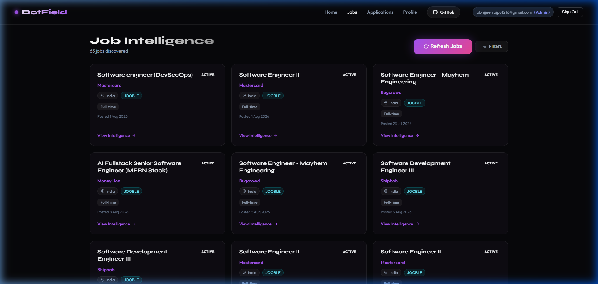
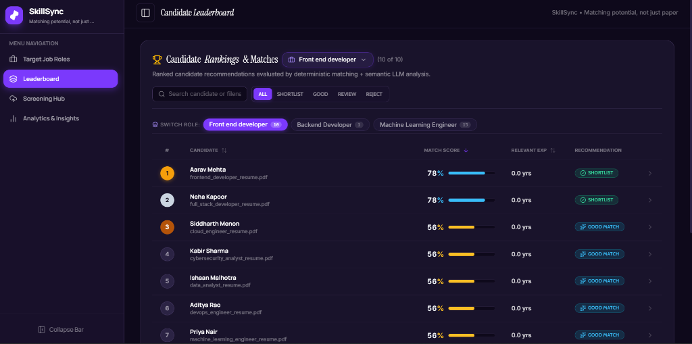
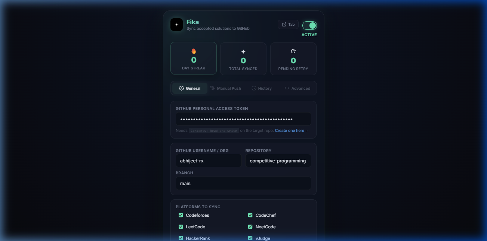

1| 

2|   
3| 

4| 
5| <h1 align="center">Hey there, I'm Abhijeet Singh</h1>
6| 
7| <h3 align="center">Software Engineer • Full Stack Developer • Backend Enthusiast</h3>
8| 
9| 

10|   
12| 
13| 

14|   Building full-stack applications, backend systems, and AI-powered products.
15| 

16| 
17| ---
18| 
19| ## <h2 align="center">About Me</h2>
20| 
21| 
22| 
23| I'm **Abhijeet Singh**, a final-year Computer Engineering student at **VIT-AP University** focused on software engineering and full-stack development.
24| 
25| I enjoy building applications that go beyond basic CRUD — especially systems involving **backend architecture, APIs, databases, authentication, security, data processing, and AI-powered features**.
26| 
27| My primary development stack includes **Java, Spring Boot, JavaScript, TypeScript, React, Node.js, FastAPI, PostgreSQL, MongoDB, and Docker**.
28| 
29| I'm also strengthening my fundamentals through **Data Structures & Algorithms, Object-Oriented Programming, DBMS, Operating Systems, Computer Networks, and System Design**.
30| 
31| Currently, I'm exploring **AI/LLM applications, backend architecture, distributed systems, Redis, and Android development**.
32| 
33| I care about writing software that is **reliable, maintainable, secure, and actually useful** — not just code that works on my machine.
34| 
35|  
36| 
37| ---
38| 
39| ## <h2 align="center">Connect</h2>
40| 
41| 

42|   <a href="https://github.com/abhijeet-rx">
43|     
44|   </a>
45|   &nbsp;&nbsp;&nbsp;
46|   <a href="https://www.linkedin.com/in/abhijeet-singh-3b6a39279/">
|     
48|   </a>
49|   &nbsp;&nbsp;&nbsp;
50|   <a href="mailto:abhijeetrajput216@gmail.com">
51|     
52|   </a>
53| 

54| 
55| ---
56| 
57| ## <h2 align="center">Tech Stack</h2>
58| 
59| ### Languages
60| 
61| 

62|   
63| 

64| 
65| ### Frontend
66| 
67| 

68|   
69| 

70| 
71| ### Backend
72| 
73| 

74|   
75| 

76| 
77| ### Databases & Infrastructure
78| 
79| 

80|   
81| 

82| 
83| ### Tools & Engineering
84| 
85| 

86|   
87| 

88| 
89| 

90|   <b>Core:</b> Data Structures & Algorithms • OOP • REST APIs • Authentication • JWT • RBAC • Database Design • System Design
91| 

92| 
93| ---
94| 
95| <h2 align="center">Currently Learning</h2>
96| 
97| 

98|   
99| 

100| 
101| 

102|   
103| 

104| 
105| 

106|   <b>System Design • Distributed Systems • Scalable Backend Architecture • Cloud • DevOps</b>
107| 

108| 
109| ## <h2 align="center">Featured Projects</h2>
110| 
111| <table align="center">
112| <tr>
113| 
114| <td width="50%" valign="top">
115| 
116| <h3 align="center">DOT Field</h3>
117| 
118| 

119|   <a href="https://github.com/abhijeet-rx/Dot-field-">
120|     
121|   </a>
122| 

123| 
124| 

125|   <b>Job Intelligence & Career Platform</b>
126| 

127| 
128| 

129|   An India-first job intelligence platform that discovers jobs from multiple sources, analyzes candidate-job compatibility, tailors ATS-friendly resumes, and tracks the complete application funnel from discovery to follow-up.
130| 

131| 
132| 
<b>Highlights:</b>

133| <ul>
134|   <li>Multi-source job ingestion using IndianAPI Jobs, Jooble & Adzuna</li>
135|   <li>India-specific location normalization & filtering</li>
136|   <li>SHA-256 based cross-source job deduplication</li>
137|   <li>Weighted candidate-job matching engine</li>
138|   <li>ATS resume tailoring engine</li>
139|   <li>Application tracking & funnel analytics</li>
140|   <li>JWT authentication & USER/ADMIN RBAC</li>
141|   <li>Bucket4j API rate limiting</li>
142| </ul>
143| 
144| 
<b>Java 21 • Spring Boot • React • PostgreSQL • Flyway • JPA • JWT • Docker</b>

145| 
146| </td>
147| 
148| <td width="50%" valign="top">
149| 
150| <h3 align="center">Smart Resume Screener</h3>
151| 
152| 

153|   <a href="https://github.com/abhijeet-rx/smart-resume-screener">
154|     
155|   </a>
156| 

157| 
158| 
<b>AI-Powered Resume Screening System</b>

159| 
160| 

161|   An AI-powered resume screening platform designed to extract structured candidate information, evaluate candidate-job compatibility, and generate explainable screening results.
162| 

163| 
164| 
<b>Focus Areas:</b>

165| <ul>
166|   <li>Resume information extraction</li>
167|   <li>Candidate-job matching</li>
168|   <li>AI-assisted screening</li>
169|   <li>Explainable candidate evaluation</li>
170|   <li>Automated resume analysis</li>
171| </ul>
172| 
173| 
<b>AI / Machine Learning • Python • NLP • Resume Analysis</b>

174| 
175| </td>
176| 
177| </tr>
178| 
179| <tr>
180| 
181| <td width="50%" valign="top">
182| 
183| <h3 align="center">Fika</h3>
184| 
185| 

186|   <a href="https://github.com/abhijeet-rx/fika">
187|     
188|   </a>
189| 

190| 
191| 
<b>Multi-Platform Competitive Programming Auto-Sync Extension</b>

192| 
193| 

194|   Fika is a Manifest V3 Chrome extension that watches <b>Codeforces, CodeChef, LeetCode, AtCoder, GeeksforGeeks, HackerRank, NeetCode & vJudge</b> for accepted submissions and automatically commits the final code to GitHub with clean organization and contest-based structure.
195| 

196| 
197| 
<b>Highlights:</b>

198| <ul>
199|   <li>Zero-click automatic code sync across 8+ programming platforms</li>
200|   <li>Custom directory trees organized by difficulty or contest ID</li>
201|   <li>Offscreen audio chime feedback upon successful GitHub push</li>
202|   <li>Glassmorphic options dashboard with streak counter & sync stats</li>
203|   <li>Duplicate prevention, manual push runner & full retry queue</li>
204| </ul>
205| 
206| 
<b>Chrome Extension • Manifest V3 • JavaScript • GitHub REST API • Web Audio</b>

207| 
208| </td>
209| 
210| <td width="50%" valign="top">
211| 
212| <h3 align="center">Adonis</h3>
213| 
214| 

215|   <a href="https://github.com/abhijeet-rx/Adonis">
216|     
217|   </a>
| 

219| 
220| 
<b>Autonomous AI Job Application Filler & ATS Resume Curator</b>

221| 
222| 

223|   Adonis is an AI-driven assistant that automates job applications by generating tailored, ATS-optimized resumes and cover letters, mapping candidate profiles to job requirements, and auto-filling application forms through browser automation.
224| 

225| 
226| 
<b>Highlights:</b>

227| <ul>
228|   <li>Candidate profile ingestion and management</li>
229|   <li>AI-assisted resume and skills curation</li>
230|   <li>Job-specific ATS optimization</li>
231|   <li>Automated job application form filling</li>
232|   <li>Browser-based application workflow</li>
233| </ul>
234| 
235| 
<b>Python • JavaScript • HTML • CSS • AI • ATS Automation</b>

236| 
237| </td>
238| 
239| </tr>
240| </table>
241| 
242| ---
243| 
244| ## <h2 align="center">Engineering Interests</h2>
245| 
246| 

247|   Backend Engineering • System Design • Distributed Systems • AI Engineering • Database Architecture • API Design • Scalable Applications
248| 

249| 
250| ---
251| 
252| ## <h2 align="center">GitHub Stats</h2>
253| 
254| 

255| 
256| 

257| 
258| ---
259| 
260| ## <h2 align="center">Activity Graph</h2>
261| 
262| 

263|   
264| 

265| 
266| ---
267| 
268| ## <h2 align="center">Commit Activity</h2>
269| 
270| <picture>
271|   <source media="(prefers-color-scheme: dark)" srcset="https://raw.githubusercontent.com/abhijeet-rx/abhijeet-rx/output/pacman-contribution-graph-dark.svg">
272|   <source media="(prefers-color-scheme: light)" srcset="https://raw.githubusercontent.com/abhijeet-rx/abhijeet-rx/output/pacman-contribution-graph.svg">
273|   
274| </picture>
275| 
276| ---
277| 
278| ## <h2 align="center">Philosophy</h2>
279| 
280| 

281|   
282| 

283| 
284| 
<i>"Build things worth being proud of."</i>

285| 
286| ---
287| 
288| 
<b>Always learning. Always building.</b>

289| 
